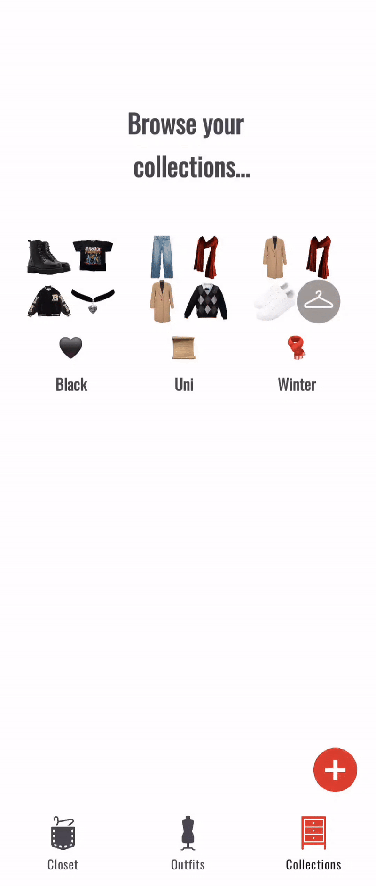

# Pocket Closet

## 🎯 Overview
The Digital Closet App is designed to help you manage your wardrobe effortlessly. With features like adding clothes with images and tags, organizing them into collections, and creating outfits using a drag-and-drop interface, this app makes wardrobe management a breeze.

## 🚀 Features
- **Add Clothes**: Easily add clothes with images and tags for better organization.
- **Organize Collections**: Group your clothes into collections for easy access.
- **Create Outfits**: Use the drag-and-drop interface to create and save outfits.

## 📱 Usage

### Adding clothes process :

### Outfit creation process : 

### Clothing management :
**Filtering with tags :**

**Deleting :**

**Editing :**

### Collection management :
**Creation, adding clothes in different ways :**

**Deleting :**

**Editing :**

## 💡 Roadmap
- **Integrated Background Remover**: Automatically remove backgrounds from clothing images.
- **Settings Panel**: Customize your app experience with a new settings panel.

## 🛠️ Installation
1. Clone the repository.
2. Open the project in your preferred IDE.
3. Run the app on your device or emulator.

An APK will be available soon (for testing purposes)

## ©️ License
This project is licensed under the MIT License.
